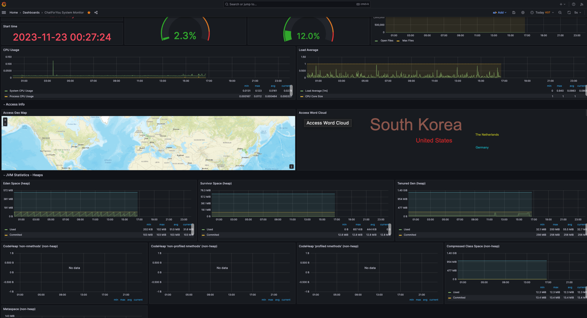
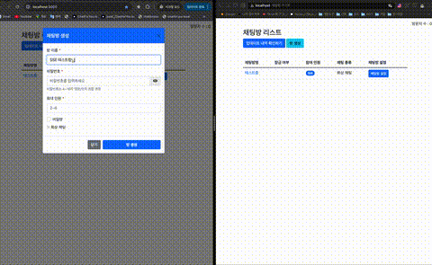

# ChatForYou v2 - WebRTC 화상채팅 & 게임 플랫폼
[](https://hits.seeyoufarm.com)

## 📋 프로젝트 개요
ChatForYou v2는 Node.js 프론트엔드와 Spring Boot 백엔드로 구성된 실시간 화상채팅 및 게임 플랫폼입니다.
WebRTC 기술을 활용한 N:M 화상채팅과 CatchMind 게임, 파일 공유 등 다양한 인터랙티브 기능을 제공합니다.

### 🏗️ 프로젝트 구조
```
ChatForYou_v2/
├── nodejs-frontend/          # Node.js 프론트엔드 서버 (포트: 3000)
│   ├── static/              # 정적 파일 (JS, CSS, 이미지)
│   ├── templates/           # HTML 템플릿
│   ├── config/              # 환경별 설정 파일
│   └── server.js            # Node.js 서버
├── springboot-backend/       # Spring Boot 백엔드 API (포트: 8080)
│   ├── src/main/java/       # Java 소스 코드
│   ├── src/main/resources/  # 설정 파일
│   └── build.gradle         # Gradle 빌드 설정
└── README.md
```

## 🛠️ 사용 기술

### Frontend
- **Node.js** - 프론트엔드 서버
- **jQuery** - DOM 조작 및 AJAX
- **Bootstrap 5** - UI 프레임워크
- **WebRTC** - 실시간 화상통신
- **Socket.IO** - 실시간 통신

### Backend
- **Java 17** - 프로그래밍 언어
- **Spring Boot** - 백엔드 프레임워크
- **Spring WebSocket** - 실시간 통신
- **Stomp** - 메시징 프로토콜
- **Kurento Media Server** - 미디어 서버

### Infrastructure
- **Gradle** - 빌드 도구
- **Docker** - 컨테이너화
- **Kubernetes** - 오케스트레이션
- **Prometheus & Grafana** - 모니터링

## ✨ 주요 기능

### 🎯 기본 기능
- **채팅방 관리**: 채팅방 조회, 생성, 삭제, 수정
- **무중단 채팅방 관리** : Redis 기반 서버 재배포 시에도 채팅방 유지 관리
- **보안 기능**: 채팅방 암호화 및 접근 제어
- **사용자 관리**: 닉네임 중복 검사 및 자동 조정
- **실시간 메시징**: DataChannel 기반 실시간 채팅

### 🎥 화상채팅 기능
- **WebRTC 화상채팅**: P2P 기반 음성/영상 통화
- **Kurento Media Server**: N:M 화상채팅 지원
- **화면 공유**: 실시간 화면 공유 기능
- **장비 선택**: 마이크/스피커 선택 기능
- **DataChannel**: 파일 전송 및 추가 채팅
- **텍스트 오버레이**: 문자 채팅 내용을 비디오에 표시하는 텍스트 오버레이 기능
- **실시간 자막**: 음성을 통한 실시간 자막 기능
- **SSE 기반 실시간 채팅 목록 확인**: SSE 기반 실시간 채팅 목록 확인 기능

### 🎮 게임 기능
- **CatchMind 게임**: N 라운드 그림 맞추기 게임
- **실시간 캔버스**: 실시간 그림 그리기
- **음성 인식**: 음성을 통한 정답 확인
- **모바일 지원**: 모바일 기기 터치 이벤트
- **Dynamic Topic**: ChatGPT 기반 동적 주제 생성

### 📁 파일 관리
- **MinIO Object Storage**: 실시간 파일 공유
- **파일 업로드/다운로드**: 이미지 파일 지원
- **용량 제한**: 최대 10MB
- **확장자 제한**: jpg, jpeg, png, gif

### 📊 시스템 관리
- **성능 모니터링**: Prometheus & Grafana
- **접속 차단**: Blacklist IP 관리
- **배치 작업**: 효율적인 방 관리
- **RESTful API**: 표준화된 API 설계

## 🌐 접속 정보
- **로컬 환경**: http://localhost:3000/chatforyou
- **운영 환경**: https://hjproject.kro.kr/chatforyou

## **_사이트 이용시 공시 사항_**
본 사이트는 오직 Spring Boot와 Node.js, JavaScript를 기본으로 하여 WebRTC 및 WebSocket 기술을 사용한 여러 기능을 공부하기 위한 사이트입니다.
**따라서 해당 사이트를 이용함에 있어 발생할 수 있는 모든 법적 책임은 사이트를 이용하시는 본인에게 있음을 명시해주시기 바랍니다.**

## **_Disclaimer when using this site_**
This site is only for studying various functions using WebRTC and WebSocket technologies based on Spring Boot, Node.js and JavaScript.
**Please note that all legal responsibilities that may arise from using this site are the responsibility of the person using the site.** 

## 🚀 구동 방법

### 1. 사전 요구사항
- **Node.js** 16+ 설치
- **Java 17** 설치
- **Kurento Media Server** 설치
- **TURN Server (coturn)** 설치
- **Redis** 설치

### 2. 프론트엔드 실행
```bash
cd nodejs-frontend

# 의존성 설치
npm install

# 로컬 환경 빌드
npm run local

# 서버 실행 (포트: 3000)
npm run start
```

### 3. 백엔드 실행
```bash
cd springboot-backend

# Gradle 빌드
./gradlew clean build

# JAR 실행 (포트: 8080)
java -Dkms.url=ws://[KMS_IP]:[PORT]/kurento -jar build/libs/*.jar
```

### 4. 환경 설정

#### 프론트엔드 설정 파일
```javascript
// nodejs-frontend/config/config.local.js
window.__CONFIG__ = {
  API_BASE_URL: 'http://localhost:8080/chatforyou/api',
};

// nodejs-frontend/config/config.prod.js
window.__CONFIG__ = {
  API_BASE_URL: {사용자 서비스 도메인},
};
```

#### 백엔드 설정 파일
```properties
# application.properties
server.port=8080

# Kurento Media Server 설정
kms.url=ws://localhost:8888/kurento
```

### 5. Docker 실행
```bash
# 프론트엔드 Docker 빌드
cd nodejs-frontend
docker build -t chatforyou-frontend .

# 백엔드 Docker 빌드
cd springboot-backend
docker build -t chatforyou-backend .

# Docker Compose 실행
docker-compose up -d
```

## 📸 구동 화면

### 화상 채팅 화면


### DataChannel 파일 업로드/다운로드


### CatchMind 게임


### Grafana 성능 모니터링


### 실시간 자막 기능


### SSE 기능


## 📈 성능 개선
### CI/CD Pipeline with GitHub Actions for K8S Deployment
| 프로세스 단계       | 도입 전 소요시간 | 도입 후 소요시간 | 절감 시간 | 효율성 향상률 |
|---------------|-------------------|-------------------|-----------|----------------|
| **Gradle 빌드** | 105.2초          | 66초              | 39.2초    | 37.3% ↑        |
| **이미지 업로드**   | 25초             | 9초               | 16초      | 64.0% ↑        |
| **배포 자동화**    | 15초(수동)       | 14초(자동)        | 1초       | 6.7% ↑         |
| **전체 프로세스**   | 145.2초          | 89초              | 56.2초    | 38.7% ↑        |

## 🔗 관련 프로젝트
- **Python API Server**: [chatforyou-python-api](https://github.com/SeJonJ/chatforyou_python_api)
  - CatchMind 게임의 동적 주제 생성을 위한 ChatGPT 연동 서버

## 📚 Reference
- [WebRTC-SS](https://github.com/Benkoff/WebRTC-SS)
- [webrtc-lab](https://github.com/codejs-kr/webrtc-lab)
- [Kurento Documentation](https://doc-kurento.readthedocs.io/en/latest/index.html)
- [Progress Bar](https://kimmobrunfeldt.github.io/progressbar.js/)
- [Spinner](https://spin.js.org/)

## 📄 License
Copyright 2024 SejonJang (wkdtpwhs@gmail.com)  

This project is licensed under the GNU Affero General Public License v3.0 (the "License"); you may not use this file except in compliance with the License. You may obtain a copy of the License at:

[GNU Affero General Public License v3.0](https://www.gnu.org/licenses/agpl-3.0.html)

Unless required by applicable law or agreed to in writing, software distributed under the License is distributed on an "AS IS" BASIS, WITHOUT WARRANTIES OR CONDITIONS OF ANY KIND, either express or implied. See the License for the specific language governing permissions and limitations under the License.

## 👥 팀 소개

| 역할 | 이름 | 담당 업무 | 이메일 | 프로필 |
|------|------|-----------|---------|---------|
| 👑 **프로젝트 리더** | 장세존 | 프로젝트 총괄 · 풀스택 개발 · DevOps 담당 | wkdtpwhs@gmail.com | [GitHub](https://github.com/SeJonJ) [Tistory](https://terianp.tistory.com) |
| ⚙️ **백엔드 개발** | 김동현 | 백엔드 · 프론트엔드 기능 개발 | `이메일 예정` | `GitHub 예정` |
| 💻 **풀스택 개발** | 박태식 | 백엔드 · 프론트엔드 기능 개발 | `이메일 예정` | `GitHub 예정` |
| 🎨 **디자인 및 웹 퍼블리싱 총괄** | 임가현 | 웹 퍼블리싱 · UI/UX 디자인 | `이메일 예정` | `GitHub 예정` |

### 📬 연락처
팀원들의 개별 연락처와 GitHub 프로필은 곧 업데이트될 예정입니다.