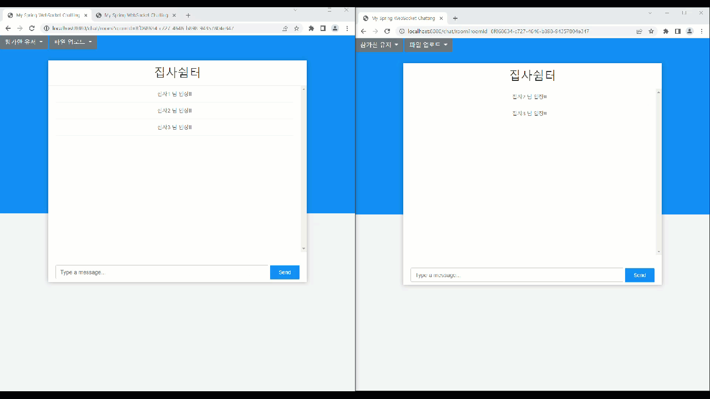

# SpringBoot WebRTC Chatting And Game Project
[](https://hits.seeyoufarm.com)

## 0. Springboot - WebRTC 화상채팅 프로젝트
- SpringBoot 기반 웹 소켓 채팅 및 Kurento Media Server 를 이용한 N:M 화상채팅
- WebRTC 를 활용한 다양한 이벤트 및 CatchMind 게임 구현
- 상세한 코드 설명은  https://terianp.tistory.com/184 에서 확인 가능합니다.

### 브랜치별 설명
- master : 기본 문자 채팅
- master-Webrtc-jpa : 일반 채팅 + 실시간 화상 채팅, 화면 공유(P2P)
- master-webrtc-kurento-jpa : kurento 미디어 서버를 활용한 webrtc 화상 채팅
- master-webrtc-catchmind : 화상채팅 + catchmind 게임

## 1. 사용기술
- Java 11
- Spring Boot MVC
- Gradle
- AJAX
- jquery
- WebSocket & SocketJS
- Stomp
- WebRTC : P2P 실시간 화상 채팅, 화면 공유
- WebRTC DataChannel : DataChannel 을 사용한 채팅
- Kurento Media Server : N:M 채팅을 위한 KMS 사용

[//]: # (## 2. 다이어그램)
[//]: # (![Chat.png]&#40;info%2FChat.png&#41;)

# 2. ChatForYou : 주요 기능 요약
ChatForYou는 실시간 화상채팅을 위한 프로젝트입니다.
화상채팅뿐만 아니라 파일 공유 및 게임 등의 다양한 인터랙티브 기능을 이용할 수 있도록 개발되었습니다.

## 기본 기능

### 1. 채팅방 관리
- **채팅방 생성**: 사용자의 채팅 방 생성 기능
- **중복 검사**: 이미 존재하는 채팅방 이름에 대한 중복 검사를 실행
- **닉네임 선택**: 중복된 닉네임이 있을 경우, 자동으로 임의의 숫자를 추가하여 유니크하게 조정
- **채팅방 입장 및 퇴장 관리**: 사용자의 채팅방 입장 및 퇴장 기능

### 2. 채팅 기능
- **메시지 전송/수신**: RestAPI를 기반으로 한 메시지 송수신 기능을 제공
- **유저 리스트 및 참여 인원 확인**: 채팅방 내 유저 리스트와 현재 참여 인원 수를 확인 가능

## 추가 기능

### 1. 보안 및 관리
- **채팅방 암호화**: 채팅방 생성 시 암호를 설정하여 채팅방 입장 보안 강화
- **채팅방 삭제 및 인원 설정**: 필요에 따라 채팅방을 삭제하거나 최대 인원 수를 설정 가능

## 2. 화상채팅 기능
- **WebRTC 화상 채팅**: P2P 기반의 음성 및 영상 채팅과 화면 공유 기능
- **Kurento Media Server**: N:M 화상 채팅과 양방향 화면 공유를 지원
- **DataChannel**: DataChannel을 활용한 추가적인 채팅 기능 및 파일 전송 기능
- **장비 선택 기능**: 화상 채팅 시 사용할 스피커와 마이크를 선택 가능

## 3. 시스템 관리 및 모니터링

- **BatchJob 및 RESTful API 개발**: 효율적인 방 관리를 위해 배치 작업 및 RestFull API 개발
- **성능 모니터링**: Prometheus 및 Grafana를 이용한 시스템 성능 모니터링
- **접속 차단**: Blacklist IP 접속 차단

## 4. 파일 관리

- **minIO Object Storage**: 실시간 파일 공유 기능 : 파일 업로드 및 다운로드  
  -> 확장자 제한 : jpg, jpeg, png, gif  
  -> 용량 제한 : MAX 10MB

## 5. CatchMind 게임
- **게임 구성**: N 라운드로 진행되는 CatchMind 게임 개발
- **실시간 그림 그리기**: 실시간 캔버스를 사용한 그림 그리기 이벤트
- **게임 진행자와 참여자 이벤트**: 게임 진행자와 참여자를 위한 별도의 이벤트 관리
- **음성 인식 API**: 음성 인식을 통한 정답 확인 기능
- **모바일 이벤트**: 모바일 기기에서의 게임 이벤트 구현
- **Dynamic Topic Generation**  
  - Python과 ChatGPT를 활용하여 실시간으로 생성.
  - 게임의 주제를 보다 동적이고 예측할 수 없게 만들어 참여자들에게 매 게임마다 색다른 경험 제공
    https://github.com/SeJonJ/chatforyou_python_api

# 3. 구동방법
1) Spring Server Installation  
- Kurento Media Server 설치  
- turn Server 설치 : coturn  
- Kurento Media Server 사용시 환경변수 설정 필요 : -Dkms.url=ws://[KMS IP]:[PORT]/kurento

2) JAR Build
- java -Dkms.url=ws://[KMS IP]:[PORT]/kurento -jar jar파일명

3) Docker Container
- Spring 프로젝트를 Docker Image 로 만들기 위한 DockerFile
```bash
FROM adoptopenjdk:11-jdk as builder

# 작업 디렉토리를 설정합니다.
WORKDIR /workspace/app

# 프로젝트의 모든 파일을 Docker 이미지 내부로 복사합니다.
COPY . .

# Gradle을 사용하여 프로젝트를 빌드합니다.
RUN ./gradlew clean build -x test

# 런타임 이미지를 생성합니다.
FROM adoptopenjdk:11-jdk

# 3. 8443 포트를 외부로 노출합니다.
EXPOSE 8443

# 빌드된 JAR 파일을 런타임 이미지로 복사합니다.
COPY --from=builder /workspace/app/build/libs/*.jar app.jar

# Spring Boot 애플리케이션을 실행합니다.
ENTRYPOINT ["java", "-jar", "/app.jar"]
```

4) Python-Server
- catchmind 게임 구동을 위해서는 chatforyou-python-api 서버를 필수로 구동해야합니다.


# 4. ChatForYou
https://hjproject.kro.kr:8653

# 230914
- 자체 서버 배포 완료!
- 현재 kurento 화상채팅을 적용한 서버 배포중입니다. 다만 아직 안정화 중이라서 자주 꺼지거나 그럴 수 있습니다
- 자체 서버를 사용하기 때문에 이전보다 조금 더 느릴 수 있습니다
- 자체 인증서를 사용하기 때문에 사이트에 문제가 있을 수 있다고 나오지만...그런 이상한 사이트 아니에요ㅠ.ㅠ 

# **_사이트 이용시 공시 사항_**
본 사이트는 오직 springboot 와 JavaScript 를 기본으로 하여 WebRTC 및 WebSocket 기술을 사용한 여러 기능을 공부하기 위한 사이트입니다.
**따라서 해당 사이트를 이용함에 있어 발생할 수 있는 모든 법적 책임은 사이트를 이용하시는 본인에게 있음을 명시해주시기 바랍니다.**

# **_Disclaimer when using this site_**
This site is only for studying various functions using WebRTC and WebSocket technologies based on springboot and JavaScript.
**Please note that all legal responsibilities that may arise from using this site are the responsibility of the person using the site.** 

# 5. 구동 화면

  

### 화상 채팅 화면
  
  
### Grafana 성능 모니터링 && Access 모니터링  
  

### DataChannel file Up/Download
  

## CatchMind  
  

# Reference
https://github.com/Benkoff/WebRTC-SS

https://github.com/codejs-kr/webrtc-lab

https://doc-kurento.readthedocs.io/en/latest/index.html

progress-bar  
- https://kimmobrunfeldt.github.io/progressbar.js/

spinner  
- https://spin.js.org/

# License
Copyright 2024 SejonJang (wkdtpwhs@gmail.com)  
This project is licensed under the GNU Affero General Public License v3.0 (the "License"); you may not use this file except in compliance with the License. You may obtain a copy of the License at:

[GNU Affero General Public License v3.0](https://www.gnu.org/licenses/agpl-3.0.html)

Unless required by applicable law or agreed to in writing, software distributed under the License is distributed on an "AS IS" BASIS, WITHOUT WARRANTIES OR CONDITIONS OF ANY KIND, either express or implied. See the License for the specific language governing permissions and limitations under the License.


## Contact
email : wkdtpwhs@gmail.com